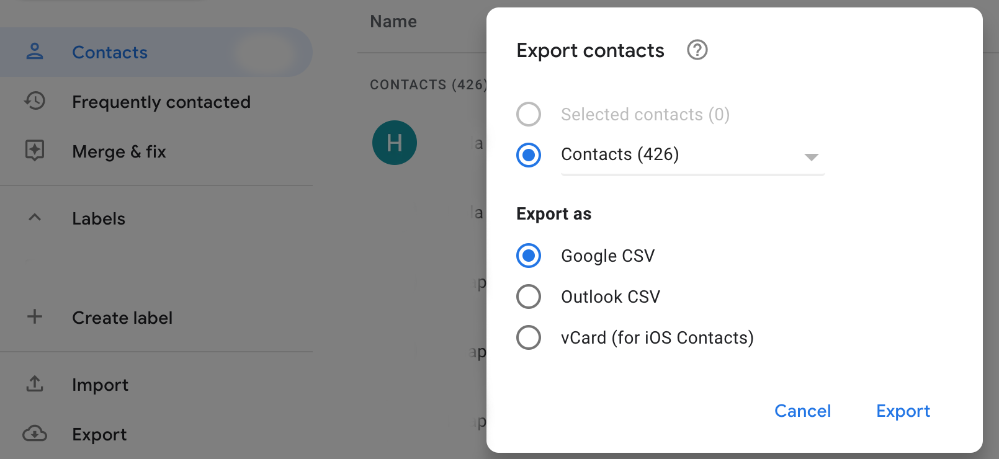

# WhatsApp Spammer

## Instructions

+ Download your selected contacts as CSV, save it as ``` ./google.csv ```


+ Create ```/venv/ ``` and dependencies

``` bash 

python3 -m venv venv
source venv/bin/activate
pip3 install --upgrade pip
pip3 install -r requirements.txt

```


+ Install your web browser
+ Move the downloaded driver to path (Firefox in this case):

    ``` bash 

    sudo  cp ./geckodriver /usr/local/bin

    ```

    ## Drivers

    Selenium requires a driver to interface with the chosen browser. Firefox, for example, requires geckodriver, which needs to be installed before the below examples can be run. Make sure it’s in your PATH, e. g., place it in /usr/bin or /usr/local/bin.

    Failure to observe this step will give you an error selenium.common.exceptions.WebDriverException: Message: ‘geckodriver’ executable needs to be in PATH.

    Other supported browsers will have their own drivers available. Links to some of the more popular browser drivers follow.

    + Chrome: 	https://sites.google.com/a/chromium.org/chromedriver/downloads
    + Edge: 	https://developer.microsoft.com/en-us/microsoft-edge/tools/webdriver/
    + Firefox: 	https://github.com/mozilla/geckodriver/releases
    + Safari: 	https://webkit.org/blog/6900/webdriver-support-in-safari-10/

+ RUN IT

    ``` bash 

    python3 wa.py

    ```